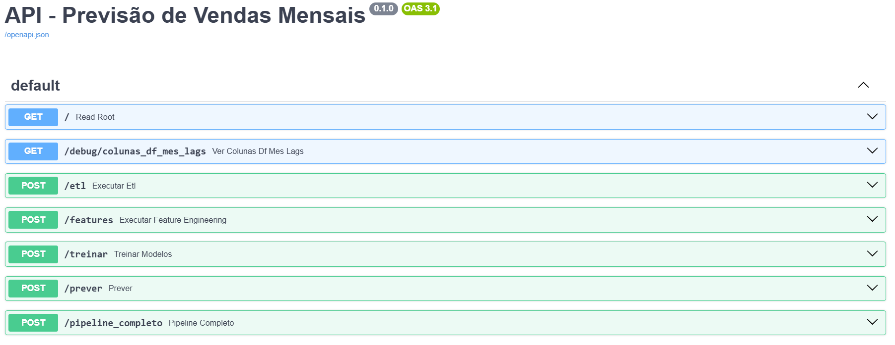

# 🧠 Projeto de Previsão de Vendas Mensais - Desafio Kaggle

Este projeto resolve o problema do **desafio "Predict Future Sales"** do Kaggle, propondo um pipeline completo e modularizado de regressão baseado em séries temporais de vendas históricas para prever a quantidade de itens vendidos no próximo mês.

---

## 🌟 Objetivo

> Prever o número de unidades vendidas no próximo mês (Nov/2015) para cada par `(shop_id, item_id)` com base nos dados históricos de vendas mensais.

---

## 📁 Estrutura do Projeto

```
desafio_exerc_2/
├── main.py                      # Orquestra o pipeline completo
├── api_pipeline.py             # API com FastAPI para execução do pipeline e predição
├── .env                        # Variáveis de ambiente (ZIP_PATH_2, EXTRACT_PATH_2)
├── dados/
│   ├── arquivos/               # Dados brutos extraídos do desafio (CSV)
│   └── previsoes/              # Previsões geradas pelo modelo
├── ml_pipeline/
│   ├── etl/                    # Leitura dos dados e extração de arquivos ZIP
│   ├── features/               # Criação de features, lags, variáveis temporais
│   ├── models/
│   │   ├── training.py         # Avaliação, GridSearch, seleção do melhor modelo
│   │   └── prediction.py       # Geração de previsões
│   ├── evaluation/             # Métricas customizadas (ex: CCC)
│   └── utils/                  # Funções auxiliares (salvar CSV, logs)
├── notebook/
│   └── exercicio_2.ipynb       # Desenvolvimento inicial e validação exploratória
├── README.md
├── requirements.txt
└── previsoes.csv               # Previsão final gerada
```

---

## 🔮 Tecnologias Usadas

- **Python 3.10**
- `pandas`, `numpy`, `scikit-learn`
- `xgboost`, `matplotlib`, `seaborn`
- `MLflow` para tracking de experimentos e hiperparâmetros
- `FastAPI` para expor o pipeline via API

---

## 📈 Estratégia de Modelagem

1. **EDA completa** sobre vendas, lojas, categorias e sazonalidade
2. **Feature Engineering robusta** com:
   - Lags temporais
   - Indicador de dezembro
   - Top produtos/lojas/categorias
   - Total vendido por entidade
3. **Modelagem supervisionada** com:
   - Regressão Linear
   - Random Forest
   - XGBoost com GridSearchCV
4. **Validação temporal cruzada (TimeSeriesSplit)**
5. **Métricas**:
   - RMSE, MAE, MAPE, R²
   - Concordance Correlation Coefficient (CCC)
6. **Tracking com MLflow** para logar hiperparâmetros e métricas

---

## 🧐 Justificativa da Abordagem

> Embora o problema seja temporal (pensei inicialmente em usar modelos de séries temporais), optei por uma abordagem de **regressão supervisionada com features derivadas** pois:

- O target (`item_cnt_month`) é numérico e altamente esparso
- Modelos como XGBoost se beneficiam de features tabulares e temporais
- Algoritmos de boosting lidam bem com dados ruidosos e não linearidade
- O RMSE e CCC foram significativamente melhores que abordagens simples

---

## 🚀 Resultados

O melhor modelo final foi o **XGBoost**, com os seguintes resultados:

- **RMSE:** ~1.91
- **MAE:** ~0.96
- **R²:** ~0.45
- **CCC:** ~0.63

> O modelo foi treinado com os melhores hiperparâmetros via GridSearch e registrado no MLflow.

---

## 🚀 Como rodar o projeto (FastAPI)

### 1. Clone o repositório e crie o ambiente:
```bash
git clone https://github.com/seu-usuario/seu-repo.git
cd seu-repo/source
python -m venv desafio_exerc_2
source desafio_exerc_2/Scripts/activate  # ou .\desafio_exerc_2\Scripts\activate no Windows
```

### 2. Instale os pacotes:
```bash
pip install -r requirements.txt
```

### 3. Configure o `.env`
```env
ZIP_PATH_1=C:\caminho\para\career-con-2019.zip
EXTRACT_PATH_1=C:\caminho\para\extração\dos\csvs
```

### 4. 📈 Suba a API
```bash
uvicorn api_pipeline:app --reload
```

### 5. 🖥️ Acesse no navegador:
- Swagger UI: [http://localhost:8000/docs](http://localhost:8000/docs)

---

## 🖥️ Endpoints via FastAPI

| Rota         | Ação | Resultado |
|--------------|--------|-----------|
| `/`                  | Teste de saúde | JSON |
| `/etl`              | Leitura dos dados | status |
| `/features`         | Cria features e lags | status |
| `/treinar`          | Treina modelos com MLflow | JSON |
| `/prever`           | Gera previsão final e baixa CSV | download |
| `/pipeline_completo`       | Executa todo o pipeline completo | download CSV |


---

## 🔄 Versão do Python

- **Python 3.10**

---

## 📊 MLflow
Os experimentos são monitorados e logados automaticamente.
Para visualizar:
```bash
mlflow ui
```
Acesse: [http://localhost:5000](http://localhost:5000)

## 📆 Futuros Melhoramentos

- Integração total com `MLflow UI`
- AutoML com `Optuna` para busca de hiperparâmetros
- Serialização dos modelos finais (`.pkl`) e versionamento
- Dockerização do pipeline com FastAPI + MLflow
- Inclusão de modelos baseados em Deep Learning (LSTM, Transformers)

---

## 🙌 Créditos
- Desafio original: [Kaggle Predict Future Sales](https://www.kaggle.com/competitions/competitive-data-science-predict-future-sales/overview)
- Desenvolvido por: **Luan de Carvalho Freitas** - 25/03/2025 - 3 horas